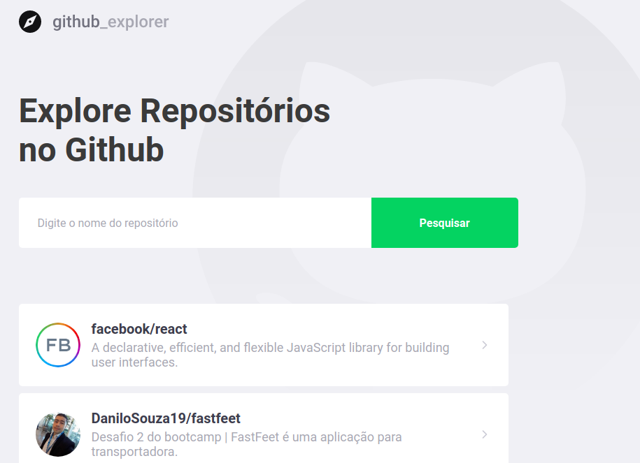
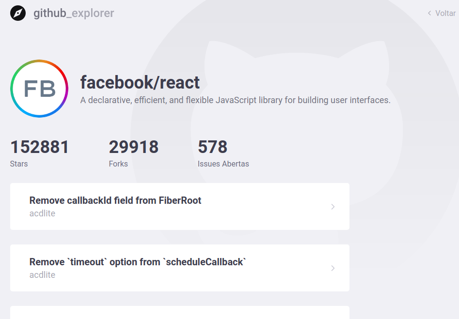

# Github explorer

## Descricao
<p>
  Esse projeto compoe uma aplicação no bootcamp 11 do Gostack que realiza consultas de repositórios do github
</p>

## Tecnologias
* ReactJS
* Typescript
* API client Axios




## Execução
* ```yarn``` -> baixar dependências
* ```yarn start``` -> para executar a aplicação (porta 3000)
